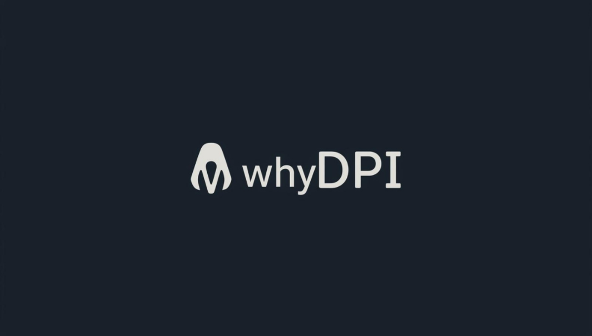

<p align="center">
  
</p>

<p align="center">
  <i>Educational DPI bypass tool.  Runs on Linux and Windows.</i>
</p>


whyDPI is a transparent TLS proxy (Linux) / packet-level TLS shaper
(Windows) combined with an optional DNS forwarder.  It ships **zero
hard-coded hostnames, domains or ISP-specific resolvers**: what works for a
given destination is discovered at runtime, cached per-SNI, and refined when
conditions change.

## How it works

1. **Netfilter hijack** — iptables/ip6tables REDIRECT sends outbound
   TCP/443 to a local transparent proxy.  A small set of rules also blocks
   QUIC (UDP/443) so browsers fall back to TCP, and (optionally) redirects
   UDP+TCP/53 to a local DoH stub resolver.
2. **ClientHello shaping** — the proxy parses the ClientHello, identifies
   the SNI, then applies a fragmentation *strategy* before forwarding the
   bytes upstream.
3. **Adaptive discovery** — for each SNI, the proxy tries the cached
   winning strategy first, then the configured default, then a list of
   fallbacks.  A strategy is considered successful only when the upstream
   reply starts with a valid TLS handshake record (`content-type 0x16`);
   HTTP block pages (`H…`) and injected RSTs are ignored.  The winning
   strategy is persisted to `~/.cache/whydpi/strategies.json`.
4. **DoH forwarding** — the optional DNS stub forwards every query as a
   DoH POST to a user-configured resolver IP.  The DoH connection itself
   transits the TLS proxy, so DNS traffic inherits the same fragmentation.

## Strategies

A strategy is a tuple `(layer, offset)`:

| Spec | Meaning |
| --- | --- |
| `record:N`       | Re-frame the ClientHello as two TLS records, split at payload byte N |
| `record:sni-mid` | Same, but split in the middle of the SNI extension |
| `record:half`    | Same, split at the payload midpoint |
| `tcp:sni-mid`    | Keep one TLS record, split the TCP send at the SNI midpoint |
| `chunked:N`      | Split the raw bytes into N-byte TCP chunks |
| `passthrough`    | Forward unchanged (used automatically for SNIs that break under any strategy) |

## Installation

### Arch Linux (AUR)

Two AUR packages are published:

- [`whydpi`](https://aur.archlinux.org/packages/whydpi) — stable, built from the latest release tag (recommended)
- [`whydpi-git`](https://aur.archlinux.org/packages/whydpi-git) — tracks the `main` branch, always bleeding-edge

```bash
paru -S whydpi           # stable
# or: paru -S whydpi-git # bleeding-edge
sudo systemctl enable --now whydpi
```

### Debian / Ubuntu

Binary `.deb` attached to each GitHub release (tested on Debian 12,
Ubuntu 22.04 and Ubuntu 24.04).

```bash
# Download the latest release's .deb for your distro:
curl -L -o whydpi.deb \
  "https://github.com/byrdltd/whyDPI/releases/latest/download/whydpi_$(curl -s https://api.github.com/repos/byrdltd/whyDPI/releases/latest | grep tag_name | cut -d\" -f4 | sed s/^v//)-1_ubuntu24.04_all.deb"
sudo apt install ./whydpi.deb
sudo systemctl enable --now whydpi
```

Available slugs on each release: `debian12`, `ubuntu24.04`, `ubuntu22.04`.
A future Launchpad PPA will bring `apt` auto-updates.

### Fedora

Grab the latest `.rpm` from the
[Releases page](https://github.com/byrdltd/whyDPI/releases) (builds for
Fedora 40 and 41 are attached), then:

```bash
sudo dnf install ./whydpi-*.noarch.rpm
sudo systemctl enable --now whydpi
```

A future Fedora COPR repo will bring `dnf` auto-updates.

### Any Linux (from source)

```bash
git clone https://github.com/byrdltd/whyDPI.git
cd whyDPI
sudo ./install.sh
```

### Windows 10 / 11

Two installation options, pick whichever fits your workflow:

**Installer (recommended)** — double-click `whydpi-*-setup.exe` from the
[Releases page](https://github.com/byrdltd/whyDPI/releases).  The
installer registers Start-menu shortcuts and optionally creates an
elevated Task Scheduler entry for autostart at login.

**Scoop** — no account, no manual download, auto-update on `scoop
update`:

```powershell
scoop bucket add whydpi https://github.com/byrdltd/whyDPI
scoop install whydpi
```

Either way, launching **whyDPI** triggers a single UAC prompt (the tray
needs admin rights to load the WinDivert kernel driver and to rewrite
adapter DNS via `netsh`).  Right-click the tray icon → **Start
whyDPI**, browse, done.

The Windows build uses packet-layer TLS fragmentation rather than a
userspace proxy; behaviour is otherwise identical to the Linux build
(per-SNI strategy discovery, session-only cache, clean shutdown).

## Configuration

whyDPI reads `~/.config/whydpi/config.toml` at startup.  All values are
optional; env vars (`WHYDPI_*`) and CLI flags override the file.  A fully
explicit example:

```toml
[dns]
mode = "doh"            # "doh" | "altport" | "off"
doh_endpoint_ip = "1.1.1.1"
doh_endpoint_path = "/dns-query"
doh_fallback_ip = "9.9.9.9"
stub_address = "127.0.0.53"

[tls]
default_strategy = "record:2"
fallback_strategies = [
    "record:2", "record:1", "record:sni-mid",
    "tcp:sni-mid", "record:half", "chunked:40",
]
probe_timeout_s = 3.0
success_min_bytes = 6

[net]
ipv6_enabled = true
block_quic = true
```

## Commands

```bash
# start (optionally pin /etc/resolv.conf to the stub)
sudo whydpi start --configure-dns

# stop and remove rules
sudo whydpi stop

# inspect the per-SNI strategy cache
sudo whydpi cache list
sudo whydpi cache clear
sudo whydpi cache forget example.org

# stand-alone diagnostic: report the strategy each target needs
sudo whydpi probe example.org example.net

# DNS resolver
sudo whydpi dns-configure
sudo whydpi dns-restore
```

## System requirements

**Linux**
- Python 3.10+ (`tomllib`; on 3.10 install `tomli` via `requirements.txt`)
- `iptables` or `iptables-nft` (IPv6 rules need `ip6tables`)
- Root privileges

**Windows**
- Windows 10 1809 or later, or Windows 11 (x64)
- Administrator rights (UAC prompt at launch; WinDivert driver + `netsh`
  both require elevation)
- Nothing to pre-install; the installer bundles Python, `pydivert` and
  the signed WinDivert 2.x driver.

## Notes

- No hostnames are shipped in code.  The DoH endpoint is an IP.  The SNI
  cache only contains hosts *you* have visited.
- A success in `whydpi probe` means the upstream produced a valid TLS
  handshake reply — not an HTTP 200.  Middlebox block pages and RSTs are
  rejected explicitly.
- IPv6 HTTPS is fully proxied (unlike v0.1.0 which blocked it).  Disable
  with `net.ipv6_enabled = false` if the upstream breaks IPv6.

## Disclaimer

For educational and research purposes only.  Use only where you are
authorized to test, and comply with applicable laws and network policies.
